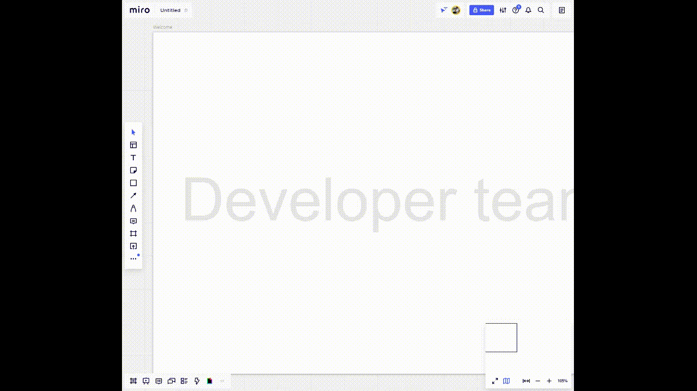

# Miro Giphy Plugin

This [Miro](https://miro.com/) plugin allows you to easily and quickly search for gifs on [Giphy](https://giphy.com/) and add them directly to your board via drag-and-drop.

## Development

The ui folder holds a simple React app which is making use of the [@giphy/react-components](https://github.com/Giphy/giphy-js) package for the gif search as well as the [Miro SDK](https://miro.com/app/static/sdk.1.1.js) for dropping the image onto the board.

- To run the application in local development, just run `npm start` in the ui directory.

- To be able to test inside Miro you can run `npx ngrok http 3000` in a second shell to get an externaly accessible https-url which you can use for the `Web-plugin` url in your app settings.

### Requirements

- For both the production build and local dev run you need to set the environment variable `REACT_APP_GIPHY_API_KEY` to hold your Giphy API KEY.

- To be able to create the widgets on the board, the Miro app needs to have the `boards:write` OAuth scope checked in the app settings.

## Miro Integration

- The default React's [index.html](./ui/public/index.html) renders the content of the so called "library" window in the Miro ui.

- The static [plugin.html](./ui/public/plugin.html) will be the actual `Web-plugin` url of the app and acts as the entry point that sets up the icon in the `bottomBar` and opens the React app as a library window on click.

## Deployment

The [ci-cd.yml](.github/workflows/ci-cd.yml) GitHub Actions workflow will run the `npm run build` command and push the resulting `build` directory to the branch `gh-pages` which is being set up to be published via GitHub Pages